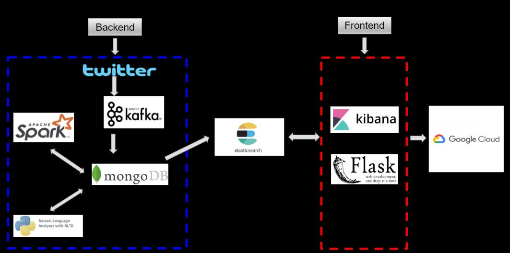
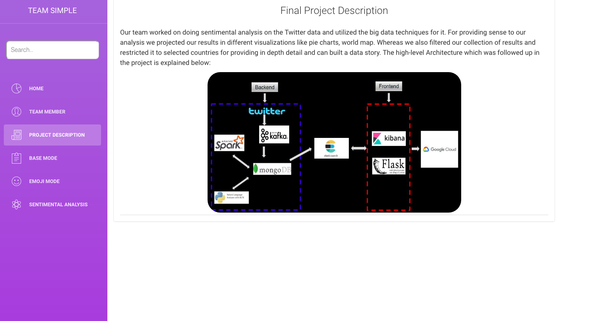

# TeamSimple

Our team aimed to create a dashboard of real-time twitter map with emojis displaying sentiments of the selected regions for creating a data story. Big data techniques are used through out the implementation of the project.We utilized the following Big Data techniques from the class: Kafka, Pyspark, Mongodb, Elastic search, Kibana. Whereas for doing the sentiment analysis of the Emoji, we used Natural Language toolkit (NLTK) and used Flask framework for structuring our visual dashboard. A high level overview providing  detail on sequencing about the activities overtaken in the project is mentioned below, along with the commands on initiating and stopping the servers and running the project.   

## Current architecture:

  
## Steps 

  ### To start

#### Back End

**on macOS**

1. Start zookeeper first:

   `zookeeper-server-start /usr/local/etc/kafka/zookeeper.properties`

2. Start Kafka:

   `kafka-server-start /usr/local/etc/kafka/server.properties`

3. Start producer:

   Need to be in project folder. Couple libraries might need to be install by using pip.

   Read tweets from twitter API, then send it to kafka

   `python Tweepy-kafkaProducer.py`

4. Start Mongo database:

   `docker run -d -p 27017-27019:27017-27019 --name mongodb mongo:4.0.4`

5. Start consumer

   read the tweets from kafka to Mongodb.

   `python kafkaConsumerMongo.py`

6. Start python script that reads tweets from tweets collection --> get emoji --> store emoji counts in emoji collection

   `python sentimentAnalysis-mongo.py`

7. Run Spark analysis

   `python sparkAnalysis_countTextSent.py`

   `python SparkSentiment.py`

**On GCP**

0. change to `root` user

   `sudo su`

1. Start zookeeper and kafka:

   `cd /usr/local/kafka`

   `bin/zookeeper-server-start.sh -daemon config/zookeeper.properties `

   `bin/kafka-server-start.sh -daemon config/server.properties`

2. Start producer:

   Need to be in project folder. Couple libraries might need to be install by using pip.

   Read tweets from twitter API, then send it to kafka

   `python3 ~/TeamSimple/Tweepy-kafkaProducer.py`

3. Start Mongo database:

   `docker container rm mongodb`

   `docker run -d -p 27017-27019:27017-27019 --name mongodb mongo:4.0.4`

4. Start consumer

   read the tweets from kafka to Mongodb.

   `python3 ~/TeamSimple/kafkaConsumerMongo.py`

5. Start python script that reads tweets from tweets collection --> get emoji --> store emoji counts in emoji collection

   `python3 ~/TeamSimple/sentimentAnalysis-mongo.py`

#### Front End

**on macOS**

0. change to `root` user

   `sudo su`

1. start `elasticsearch` and `kibana`

   Run:

   `elasticsearch`

   `kibana`

2. activate virtual machine

   in `front-end` folder run:

   `source [VENVNAME]/bin/activate`

3. run two Python script

   Search tweets and emojitweets

   `python searchapp/index_tweets.py`

   `python searchapp/index_emojitweets.py`

4. Run website

   `python searchapp/run.py`

**On GCP**

1. start `elasticsearch` and `kibana`

   Run:

   `sudo /etc/init.d/elasticsearch start`

   `sudo /etc/init.d/kibana start`

   wait for a few seconds for fully starting `elasticsearch`

2. run two Python script

   Search tweets and emojitweets

   `cd ~/TeamSimple/front-end/searchapp`

   `python3 index_tweets.py`

   `python3 index_emojitweets.py`

3. Run flask app:

   `cd ~/TeamSimple/front-end/searchapp`

   `python3 run_on_cloud.py`

### To stop:

`Ctrl+c` for two python scripts

Then Stop Kafka first:

`kafka-server-stop`

Stop Zookeeper:

`zookeeper-server-stop`

Stop and remove docker container for Mongo database:

`docker container stop CONTAINER_NAME`

`docker container rm CONTAINER_NAME`

### Screenshots: 

All tweets count statistics:

All emoji count statistics:

Map of all tweets:

Emoji cloud:

Overall text and emoji sentiment analysis:

Statistics of tweets containing "hello":

Map of tweets containing "hello":

Text sentiment analysis of tweets containing "hello":

Team members:

Project description:

### Demo: 

Link to the live Demo: http://34.83.158.245:5000

Link to the video: https://www.youtube.com/watch?time_continue=1&v=nuc9oZAhIiw

