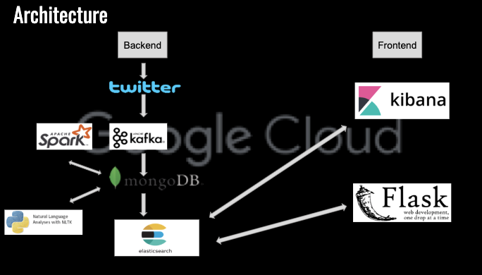

# TeamSimple

Our team aims to create a real-time twitter map with emojis. Big data techniques will be used.

Current architecture:

tweepy -> kafka -> spark -> mongodb -> elasticsearch -> kibana

tweepy -> kafka -> spark -> mongodb -> elasticsearch -> Flask,d3

## Steps

### To start

#### Back End

**on macOS**

1. Start zookeeper first:

   `zookeeper-server-start /usr/local/etc/kafka/zookeeper.properties`

2. Start Kafka:

   `kafka-server-start /usr/local/etc/kafka/server.properties`

3. Start producer:

   Need to be in project folder. Couple libraries might need to be install by using pip.

   `python Tweepy-kafkaProducer.py`

4. Start Mongo database:

   `docker run -d -p 27017-27019:27017-27019 --name mongodb mongo:4.0.4`

5. Start consumer

   `python kafkaConsumerMongo.py`

6. Start python script that reads tweets from tweets collection --> get emoji --> store emoji counts in emoji collection

   `python sentimentAnalysis-mongo.py`

#### Front End

**on macOS**

1. start `elasticsearch` and `kibana`

   Run:

   `elasticsearch`

   `kibana`

2. activate virtual machine

   in `front-end` folder run:

   `source [VENVNAME]/bin/activate`

3. run two Python script

   `python searchapp/index_tweets.py`

   `python searchapp/index_emojitweets.py`

4. Run website

   `python searchapp/run.py`

### To stop:

`Ctrl+c` for two python scripts

Then Stop Kafka first:

`kafka-server-stop`

Stop Zookeeper:

`zookeeper-server-stop`

Stop and remove docker container for Mongo database:

`docker container stop CONTAINER_NAME`

`docker container rm CONTAINER_NAME`

### Demo ## Architecture:

